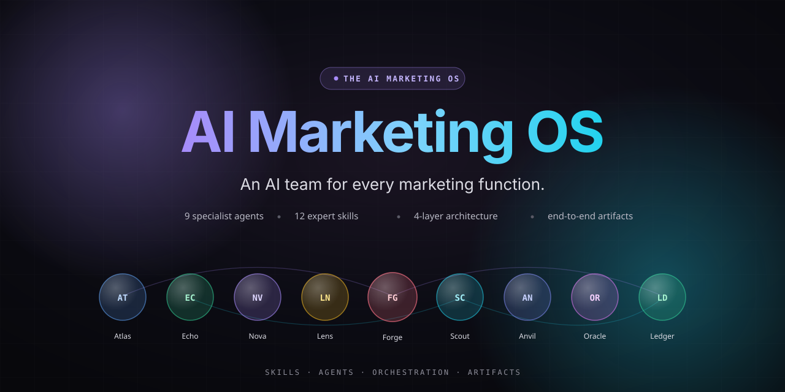

# AI Marketing OS

<p align="center">
  
</p>

<p align="center">
  <b>An interactive showcase of an autonomous AI marketing team.</b><br/>
  9 specialist agents · 12 expert skills · end-to-end mission walkthroughs.
</p>

<p align="center">
  <a href="#"></a>
  <a href="#"></a>
  <a href="#"></a>
  <a href="#"></a>
  <a href="#"></a>
</p>

---

## What this is

`ai-marketing-os` is a cinematic, end-to-end showcase site for the AI Marketing OS — a thesis that modern marketing teams should be operated as an **orchestrated team of AI agents**, not a stack of seven SaaS tools and a few scarce specialists.

It pairs a narrative landing experience with a fully interactive **Launch mission** that streams agent handoffs, console output, and typed artifacts in real time. The pre-scripted mission timeline runs entirely client-side, so the demo is reproducible and never burns API credits.

> Disclaimer: this site is a demo. All scenarios, agents, missions, artifacts, metrics, and figures shown are hypothetical and use synthetic data created for demonstration purposes only.

## The pitch

Modern marketing teams face four compounding problems:

1. **Expertise is locked in specialists** — a senior CRO consultant is $5K/audit; a real growth scientist is rare.
2. **Tooling sprawl** — Optimizely + Outreach + Clay + HubSpot + ZoomInfo + Ahrefs stacks to $20–50K/month.
3. **Generic AI doesn't solve it** — ChatGPT can write copy, but it won't run your sample-size calculation or score your pipeline with a real model.
4. **Prompts die in chat windows** — experiments are private threads with no compounding system.

The AI Marketing OS reframes this as a 4-layer architecture: **skills → agents → orchestration → artifacts**.

## The architecture

| Layer | Count | Role |
| --- | --- | --- |
| **Skills** | 12 | Markdown methodologies (Bayesian A/B math, MEDDPICC, CRO audits, cohort LTV, …) |
| **Agents** | 9 | Named specialists with clear ownership that load one or more skills |
| **Orchestration** | — | Agents hand off typed artifacts along a graph; the data flow is the program |
| **Artifacts** | ∞ | Real deliverables — CSVs, plans, scorecards, ROI reports — that ship |

## The 9 agents

| Agent | Role | Call sign |
| --- | --- | --- |
| **Atlas** | SEO | Mapper of demand |
| **Echo** | Content | Voice of the brand |
| **Nova** | Growth | Bayesian and bold |
| **Lens** | Conversion | Funnel surgeon |
| **Forge** | Outbound | Sequence architect |
| **Scout** | Sales Pipeline | Signal in the noise |
| **Anvil** | Sales Playbook | Deal carpenter |
| **Oracle** | Revenue Intelligence | Reads the losses |
| **Ledger** | Finance | Unit economics conscience |

## The 12 skills

Grouped by category:

- **Growth**: growth-engine, conversion-ops, creative-ops, content-ops
- **Sales**: outbound-engine, sales-pipeline, sales-playbook, revenue-intelligence
- **Ops**: seo-ops, finance-ops, podcast-ops, team-ops

The upstream methodology library lives at [`ai-marketing-claude-skills`](https://github.com/varunk130/ai-marketing-claude-skills).

## Pages

| Route | Purpose |
| --- | --- |
| `/` | Overview landing: hero, problem, solution, extent, why-now, how-it-works, skills, missions, CTA |
| `/how-it-works` | Architecture deep-dive: layer-by-layer walkthrough with code panels and contrast tables |
| `/skills` | The 12 skills cataloged by category, each linking to its upstream README |
| `/missions` | Mission scenarios (Launch, Rescue a Pipeline, A Week at the Org) |
| `/missions/launch` | Fully interactive Launch mission with live agent graph + console + artifact feed |
| `/about` | Why this exists + related portfolio |

## Quickstart

```bash
git clone https://github.com/varunk130/ai-marketing-os.git
cd ai-marketing-os
npm install
npm run dev
```

Then open <http://localhost:3000>.

### Scripts

| Script | What it does |
| --- | --- |
| `npm run dev` | Start the Next.js dev server with Turbopack |
| `npm run build` | Production build |
| `npm start` | Serve the production build |
| `npm run lint` | Run ESLint |

## Project structure

```
.
├── app/                          # Next.js app router
│   ├── about/                    # About page
│   ├── how-it-works/             # Architecture deep-dive
│   ├── missions/                 # Mission scenarios
│   │   └── launch/               # Interactive Launch mission
│   ├── skills/                   # Skills catalog
│   ├── globals.css               # Design tokens + Tailwind v4 theme
│   ├── layout.tsx                # Root layout (header + footer)
│   └── page.tsx                  # Home (overview)
├── components/
│   ├── mission/                  # Mission runtime (console, graph, widgets, …)
│   ├── overview/                 # Landing-page sections
│   ├── site/                     # Header + footer chrome
│   └── ui/                       # Reusable primitives
├── data/
│   ├── agents.ts                 # 9 specialist agents
│   ├── skills.ts                 # 12 skills
│   ├── missions.ts               # Mission summaries
│   └── missions/launch-timeline.ts
├── lib/
│   ├── hooks/use-typewriter.ts
│   ├── mission-store.ts          # Zustand store for mission playback
│   └── utils.ts
└── public/
    └── hero.svg                  # README + OG hero image
```

## Tech stack

- **Framework**: [Next.js 16](https://nextjs.org/) (App Router, Turbopack)
- **UI**: [React 19](https://react.dev/) + [Tailwind CSS v4](https://tailwindcss.com/)
- **Motion**: [Framer Motion 12](https://www.framer.com/motion/)
- **Graph**: [@xyflow/react](https://reactflow.dev/) for the live agent graph
- **State**: [Zustand](https://zustand-demo.pmnd.rs/) for mission playback
- **Icons**: [lucide-react](https://lucide.dev/)
- **Fonts**: [Geist Sans + Geist Mono](https://vercel.com/font)
- **Language**: TypeScript 5

## Design system

The site uses a custom dark-first design system defined in `app/globals.css`:

- A 5-step **surface ladder** for clear visual hierarchy
- A 4-step **foreground ladder** for accessible text contrast
- A vibrant **brand palette**: violet, cyan, pink, amber, emerald, indigo, rose, fuchsia
- Animation utilities for drift, soft pulse, and shimmer

## Contributing

This is a personal portfolio project. The `main` branch is protected:

- The repository owner can push directly when needed
- All other contributions must come through a pull request and require owner approval (enforced via `CODEOWNERS` and branch protection)

If you spot a bug or have a suggestion, open an issue — happy to chat.

## Related projects

This site is part of a broader portfolio of AI-builder repositories:

- [`ai-marketing-claude-skills`](https://github.com/varunk130/ai-marketing-claude-skills) — the 12-skill source library this site visualizes
- [`ai-pm-agents-suite`](https://github.com/varunk130/ai-pm-agents-suite) — a 6-agent PM pipeline + 3 standalone PM agents
- [`ai-gtm-skill-library`](https://github.com/varunk130/ai-gtm-skill-library) — 31 opinionated GTM skills
- [`ai-ux-skill-library`](https://github.com/varunk130/ai-ux-skill-library) — 12 frameworks for UX of AI products
- [`ai-workflow-playbooks`](https://github.com/varunk130/ai-workflow-playbooks) — 21 playbooks + 10 skills + 4 guardians
- [`claude-code-skills`](https://github.com/varunk130/claude-code-skills) — 29 production-grade skills

## Author

Built by **[Varun Kulkarni](https://github.com/varunk130)** — AI Builder at Microsoft, Forbes Tech Council member, and author of a portfolio of AI agent and skill libraries spanning product, GTM, UX, and decision-making.
